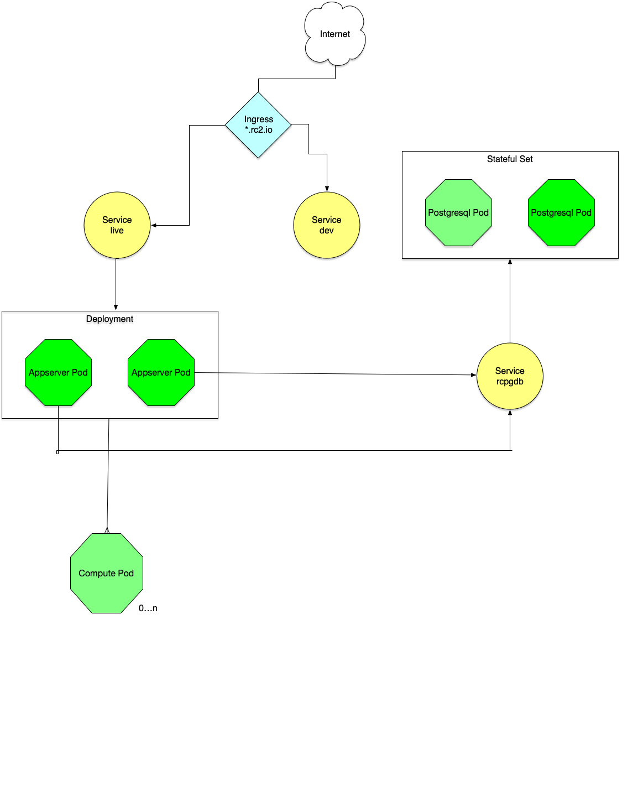

```{r setup, include=FALSE}
knitr::opts_chunk$set(echo = FALSE)
```

## Important links

DSSV 2020 Talk: [https://github.com/jharner/DSSV2020rspark](https://github.com/jharner/DSSV2020rspark)

RCompute: [https://github.com/jharner/rcompute](https://github.com/jharner/rcompute)

RHadoop: [https://github.com/jharner/rhadoop](https://github.com/jharner/rhadoop)

RSpark-cluster: [https://github.com/jharner/rspark-cluster](https://github.com/jharner/rspark-cluster)

RSpark Tutorial: [https://github.com/jharner/rspark-tutorial](https://github.com/jharner/rspark-tutorial)

Rc$^2$ Server: [https://github.com/rc2server](https://github.com/rc2server)

Rc$^2$ Swift Client: [https://github.com/mlilback/rc2SwiftClient](https://github.com/mlilback/rc2SwiftClient)

Rocker Project: [https://www.rocker-project.org](https://www.rocker-project.org)

Jupyter Docker Stacks: [https://github.com/jupyter/docker-stacks](https://github.com/jupyter/docker-stacks)

## DevOps for Data Science

Data Science Platforms are complex! How do we solve the data analysis issues of:  

* collaboration,  
* sharing, 
* reliability  
* scalability, and  
* reproducibility.  

DevOps (development + operations) has been revolutionized by containers and methods of orchestrating containers. Specifically, we will examine two technologies which are changing how complex software systems are built, deployed, and maintained. These are:  

* [Docker](https://www.docker.com): a technology for building, deploying, and running container images;  
* [Kubernetes](https://kubernetes.io): a technology for deploying, scaling, and managing containerized applications. 

## Reproducibility

This presentation focuses on reproducibility which exists at many levels:  

* **Repeatable**: same data, same code, same user $\leadsto$ same results 
* **Reproducible**: same data, same code, different user $\leadsto$ same results \   
Referee for a journal paper 
* **Strong Reproducilbility**: same data, different code, different user $\leadsto$ comparable results \   
Competitions and multiple research teams 
* **Replicable**: different data, different code, different user $\leadsto$ comparable results \     
Meta analyses 
* **Generalizable**: different data, same code, different user $\leadsto$ comparable results \   
Productizing machine learning algorithm

These definitions (except for the 3rd) are from NSF and assume the same underlying hypotheses.

## Basic Tools for Reproducibility

Reproducible computing and reporting require the following underlying skills:

* the Linux CLI 
* basic bash scripting 
* make 
* Docker/ Docker Hub 
* git/ GitHub 
* R/ Python 

The following skills are required for certain use cases: 

* R package development
* ansible 
* Pandoc 
* TeX/ LaTeX

## Required Environments for Reproducibility

* computing infrastructure 
  + Docker for creating images/ containers based on Linux 
  + Docker Hub for storing/ deploying pre-built images 
  + bash scripts for automating the docker build process 
  + version tags to identify the pulled images 

* coding/ reporting projects 
  + git for version control, tracking changes, branching, etc. 
  + GitHub for hosting software projects and for providing version control and collaboration features 
  + make for automating the code build process 
  + version tags to identify the project state 
  
The version tag of the Docker Hub images should match the version tag of the GitHub project at any given step in the development process for the images and the project repo, respectively. 

## Creating a Reproducible Workflow

* Build the computing environment first, at least approximately. 
  + download a base image from Docker Hub---perhaps just a Linux image, a Rocker image, etc.
  + write a Dockerfile extending the base image, e.g., adding R packages  
  + add configuration files as needed 
  + write shell scripts to automate building/running containers and pushing images to Docker Hub

Your container (a running instance of an image) must have a development environment for running code using literate programminge, e.g., R Markdown. 

* Build the coding environment. 
  + start a project repository on GitHub, initially with a `README` file  
  + clone the GitHub repo to the container running the editing environment 
  + use R Markdown for literate programming 
  + use `make` to automate the project build process 
  + stage, commit, and push to GitHub often 

## Docker Applications

Docker containers run a single service, although there are workarounds. What if you need multiple services, e.g., RStudio and PostgreSQL?

Answer: build a Docker application with `docker-compose`, which builds multiple images (`docker-compose build`) and starts the corresponding containers (`docker-compose up`). 

[`rcompute`](https://github.com/jharner/rcompute) is Docker applications with two containers:  

* `rconnect` with an RStudio service;
* `rpsql` with a PostgreSQL service. 

By default, the containers within a Docker application are on the same network. Communication is done through defined ports. 

What if we want additional services that you only want to run occasionally, e.g., Hadoop or Spark? Or, what if we want to run some services locally and some on a cloud platform?

## Multiple Docker Applications in `rspark` 

`rspark` historically has been a self-contained Docker application running RStudio, but it is now being broken into three applicatons: 

* [`rcompute`](https://github.com/jharner/rcompute) with containers `rconnect` and `rpsql` 
* [`rhadoop`](https://github.com/jharner/rhadoop) with containers `rhive` and `rhadoop` 
* [`rspark-cluster`](https://github.com/jharner/rspark-cluster) with conainers `master` and two workers 

`rcompute` runs on an "edge" node, e.g., on your laptop or on a server.  This application will probably be adequate for most of your development work, particularly since it can also run a single-node version of Spark for machine learning development.

`rhadoop` and `rspark-cluster` run more efficiently in the cloud, e.g., in AWS, Digital Ocean, etc., but they can be run locally or on a server (at least for development).

How do these three Docker applications communicate since by default they are on separate networks.

## Anamony of a Docker Application


## `rspark` Networking


## Reproducible Demos Using `rspark`

* Database demo 
* Spark SQL demo

## Alternative Frontends

The "edge" application, in particular `rconnect`, which contains RStudio Server, can be replaced by other interfaces to Spark. Currently, we are developing:

* `rvim`, a Linux container with R installed along with `vim`.

We are exploring the `Nvim-R` plugin for `vim`. This is for programmers who prefer a CLI to automate all aspects of the project development.

* [Rc$^2$](https://github.com/rc2server), a native Swift client that communicates with a Swift cloud-based appserver, which spawns C++ `compute` instances using Kubernetes.

The compute instances in turn can communicate with `rhadoop` and `rspark-cluster` to get Hadoop and Spark services.

##



## Future Work

The `rspark` project is being expanded to better facilitate big data and big compute:

* Arrow

Apache Arrow is a software framework for statistical and machine learning applications that process columnar data. It has a column-oriented memory format that is able to represent flat and hierarchical data for efficient operations on modern CPU and GPU hardware. The Arrow memory format supports zero-copy reads for lightning-fast data access without serialization overhead.

* Kubernetes (k8s) 

[Kubernetes](https://www.digitalocean.com/community/tutorials/an-introduction-to-kubernetes) is a platform for running and coordinating related, containerized applications across a cluster of (typically virtual) machines. It manages the complete lifecycles of containerized applications and services

## Why Use `rspark`


## Old material starts here

## Docker

Docker containers are becoming essential for software development and for the deployment of complex computing environments. This talk presents Docker solutions to address these and other use cases relevant to statisticians and data scientists.

- [Rocker](https://www.rocker-project.org): R-based images built by and hosted on Docker Hub

- [Rc$^2$](https://github.com/rc2server): R-based image hosted on GitHub.

Perhaps the most important reason for using Docker by statisticians and data scientists is the complexity of their computing environments, e.g., aligning version numbers for R and its packages, drivers, SQL and NoSQL databases, Hadoop, Spark and its packages, TensorFlow and GPUs, etc.

## What is Docker?

Docker allows developers, devops, and sysadmins to develop, deploy, and run applications using containers. We call this containerization.

Containers are:

* Flexible  
* Lightweight  
* Portable  
* Scalable

A container runs natively on Linux and shares the kernel of the host machine with other containers. A container runs as a discrete process and thus its memory requirements are nearly equivalent to other executables, i.e., it is lightweight. On the other hand, a virtual machine runs a guest OS which is built on a hypervisor, through which host resources are accessed. Running multiple VMs is very heavy. 

## Why Use Docker?

A [Container Platform](https://www.docker.com/what-docker#/container-platform) provides a complete solution, e.g., the components needed for teaching a data science program. Increasingly these platforms are being built on Kubernetes.

Example: [JupyterHub](https://jupyterhub.readthedocs.io/en/stable/)

JupyterHub allows instances of a single-user Jupyter notebook to be spawned and managed. Two distributions are available:

* The [Littlest JupyterHub](http://tljh.jupyter.org/en/latest/) for 0--100 users on a single machine  
* [Zero to JupyterHub on Kubernetes](http://z2jh.jupyter.org/en/latest/) for a large number of users and machines  

Example: [RStudio Server Pro with Launcher and Kubernetes](https://support.rstudio.com/hc/en-us/articles/360021328733-FAQ-for-RStudio-Server-Pro-with-Launcher-and-Kubernetes)

RStudio Server is not supported, i.e., Launcher is a Pro product.

## Images and Containers

The two principal Docker entities are:

* Image: an executable package that includes everything needed to run an application  
* Container: a runtime instance of an image

The image contains the code, configuration files, environmental variables, libraries, and the runtime. You can see the images by running the following command in a terminal:
```
docker images
```
A container is an image with state, i.e., a user process. You can view the running containers by executing:
```
docker ps
```
or you can see all containers by exectuing:
```
docker ps -a
```

## Running an Image

You can run an image by:
```
docker run hello-world
```
If the `hello-world` image is not found locally, it is automatically downloaded and launched from [Docker Hub](https://hub.docker.com), the default image registry.

## Rocker Project

Rocker project: a widely-used suite of Docker images with customized R environments for particular tasks.

Currently, there are 17 repos in [rocker-org](https://github.com/rocker-org).

The most important to us are:  

* [rocker-versioned](https://github.com/rocker-org)
    + r-ver: versioned base R  
    + rstudio: adds rstudio  
    + tidyverse: adds tidyverse and devtools   
    + verse: adds tex and publishing packages    
* shiny  
* ml  

These and other available images provide a large number of use cases.

## Running R/Rstudio in Containers

A terminal version of R can be run in `r-base` or `r-ver`.
```
docker run --rm -ti rocker/r-base bash
```
The `rocker/r-base` image is downloaded from Docker Hub (if not already in the local filesystem) and run. The `-it` flags cause a `bash` session to start. Typing R into the terminal starts R (currently version 3.5). The `-rm` flag causes the container to be removed when the session is exited.

Or just:
```
docker run --rm -ti rocker/r-base
```

RStudio can be run by:
```
docker run -e PASSWORD=pwd --rm -p 8787:8787 rocker/rstudio
```
Open a browser with the URL `localhost:8787` and signin with user/password: `rstudio/pwd`.

## Extending Images

A developer or user may find that an image needs to be extended, e.g., a critical R package is missing or needs to be updated. This can be done in one of two ways:  

* install the R package inside the container using `install.packages`, or 
* rebuild the image by modifying the `Dockerfile`.

The first method results in mutable infrastructure, i.e., changes are made incrementally. The state of the infrastructure is thus dependent on incremental updates. This method should only be used in critical situations and should be viewed as a temporary fix.

The second method results on an immutable infrastructure, i.e., the state does not change based on actions by the user. Rather, the image is completely rebuilt by the developer.

## Rocker Deployment

Any of the Rocker images can be deployed in a single container. This container can be run on your laptop, on your departmental server, or on a cloud platform such as AWS. Although the Rocker images can be built from their GitHub sources, typically the pre-built images on Docker Hub are simply downloaded and run.

Why go to this trouble? Why not just run RStudio locally or on a server?  

Suppose you are writing a paper and you want it to be truly reproducible. At this point you want to capture and maintain not only the Rmd or Rnw files, but also the synchronized R and required package versions. Further, the R environment can be synchronized with Linux distro and version along with required storage platform for your data. 

But the reasons go well beyond reproducibility.

## Using Docker for Continuous Integration/Deployment [DevOps]

Docker is a platform for containerized networking, compute, and storage for distributed applications. Docker improves: 

* Velocity: increase flow by continuous integration (CI) and continuous delivery (CD);    
* Variation: converge artifacts with immutable binaries;  
* Visualization: visualize (elevate) services in the pipeline by bounding context and using containers for isolation.   

[Reference paper on CI/CD](https://www.docker.com/sites/default/files/WP_Docker%20and%20the%203%20ways%20devops.pdf)

### Use Kubernetes for container orchestation!

## Kubernetes

[Kubernetes](https://www.digitalocean.com/community/tutorials/an-introduction-to-kubernetes) is a platform for running and coordinating related, containerized applications across a cluster of (typically virtual) machines. It manages the complete lifecycles of containerized applications and services to provide:  

* predictability  
* reliability
* scalability  
* availabilty  

## Kubernetes Principles

Container and Kubernetes developers should adhere to certain principles:  

* immutable infrastructure: update an image with a newer image in a single operation, i.e., no incremental updates (except in emergencies);  
* declarative configuration: describe the desired state of your application.

In mutable infrastructures changes are applied incrementally, e.g., `apt-get` in Linux or `install.packages` in R. This should only be done as a temporary fix. An imperative declaration defines the state as a series of actions rather than a declaration of the desired state as is done with Kubernetes.

Kubernetes makes sure the actual state of your environment is aligned with the desired state. Not only that, Kubernetes is an online, self-healing system, i.e., it continuously takes action to ensure the current state matches the desired state.

## Kubernetes Architecture

The machines in a Kubernetes cluster are classified as:

* a master server: the primary point of contact with the cluster. It exposes the Kubernetes API, aligns the actual state to the desired state, schedules work, orchestrates communication, etc.  
* nodes: servers responsible for running workloads using local and external resources.

The API server is the management point of the cluster, e.g., for configuring Kubernetes workloads and organizational units. The API interface is RESTful. A CLI client called `kubectl` is the default method of interacting with the Kubernetes cluster from a local computer.

The basic Kubernetes unit is the pod. Containers are assigned to pods---not hosts. Pods should contain a single application or related applications, e.g., ones that need to share the same filesystem.

Kubernetes is available on AWS, Azure, and of course Google Cloud as a service. However, these cloud providers do not have predictable price models and users/developers can incur large unexpected costs.

[Digital Ocean Kubernetes](https://www.digitalocean.com/products/kubernetes/) gives the user far more control over these costs, i.e., limits can be set and the user is only charged for what is actually used.


